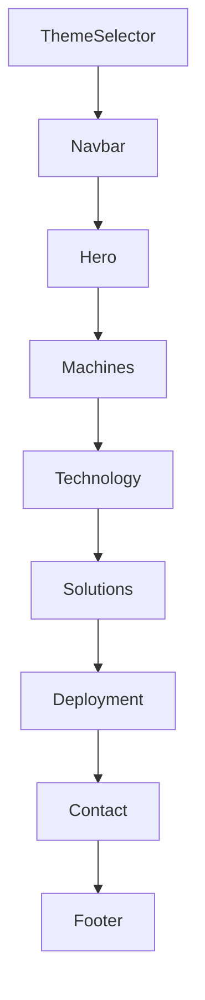

# 2. Sitemap

## Site Architecture

This is a **single-page application** with no routes. All content lives on one page with anchor-based navigation.

```
/ (index.html)
├── #home          → Hero section
├── #machines      → Machines section
├── #technology    → Technology section
├── #solutions     → Solutions section
├── #contact       → Contact section + Footer
```

There are **no separate pages**, no routing library (React Router, etc.), and no dynamic URL changes.

## Navigation Hierarchy

```
Navbar (fixed)
├── Home           → scrolls to #home
├── Machines       → scrolls to #machines
├── Technology     → scrolls to #technology
├── Solutions      → scrolls to #solutions
├── Contact        → scrolls to #contact
└── Get Quote      → scrolls to #contact

Footer
├── Quick Links
│   ├── Home       → #home
│   ├── Machines   → #machines
│   ├── Technology → #technology
│   ├── Solutions  → #solutions
│   └── Contact    → #contact
└── Contact info
    ├── Email      → mailto:hello@vendmac.com
    ├── Phone      → tel:+15551234567
    └── Location   → # (placeholder)
```

## Section Order (as rendered)



## Internal Links Map

| Source | Target | Type | Mechanism |
|--------|--------|------|-----------|
| Navbar links | `#home`, `#machines`, `#technology`, `#solutions`, `#contact` | Anchor scroll | Native `<a href="#id">` |
| Hero CTA "Explore Machines" | `#machines` | Anchor scroll | `<a href="#machines">` |
| Navbar "Get Quote" | `#contact` | Anchor scroll | `<a href="#contact">` |
| Desktop navbar "Get Quote" | `#contact` | Anchor scroll | `<a href="#contact">` |
| Footer "Quick Links" | `#home`, `#machines`, etc. | Anchor scroll | `<a href="#...">` |

## Active Section Detection

- The Navbar uses `IntersectionObserver` with `threshold: 0.3` and `rootMargin: "-80px 0px -50% 0px"` to detect which section is currently in view
- The active nav link is highlighted with a sliding indicator bar
- On mobile, the active link gets a different text color + dot indicator

## Confidence Levels

| Item | Confidence | Notes |
|------|------------|-------|
| Single-page architecture | ✅ Confirmed | No router, single App component |
| Navigation links | ✅ Confirmed | Reads from navLinks array |
| Active section detection | ✅ Confirmed | IntersectionObserver in Navbar |
| No routes | ✅ Confirmed | No router dependency in package.json |
