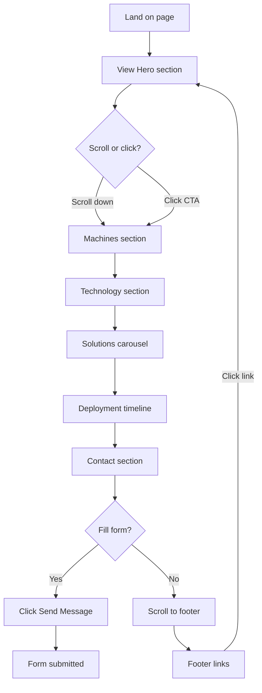

# 8. User Flows

## 8.1 Primary User Flow: Lead Generation



## 8.2 Navigation Flow

```
User arrives at page
    │
    ├── Sees Hero (full viewport)
    │   ├── Reads tagline + heading
    │   ├── Watches image carousel
    │   ├── Clicks "Explore Machines" → scrolls to #machines
    │   └── Sees partner badges
    │
    ├── Uses desktop navbar
    │   ├── Hovers links → sliding indicator follows
    │   ├── Clicks link → smooth scroll to section
    │   └── Clicks "Get Quote" → scrolls to #contact
    │
    ├── Uses mobile navbar
    │   ├── Taps hamburger → menu slides down
    │   ├── Taps link → menu closes, scrolls to section
    │   └── Taps "Get Quote" → scrolls to #contact
    │
    ├── Scrolls through sections progressively
    │   ├── Machines (4 cards)
    │   ├── Technology (6 feature cards)
    │   ├── Solutions (draggable carousel)
    │   ├── Deployment (timeline)
    │   └── Contact (info + form)
    │
    ├── Interacts with theme selector
    │   ├── Taps palette icon
    │   ├── Selects color circle → all sections re-theme
    │   └── Taps icon again to close
    │
    └── Reaches footer
        ├── Reads brand info
        ├── Uses Quick Links to navigate
        └── Sees copyright
```

## 8.3 Interaction Points

| Element | Action | Result |
|---------|--------|--------|
| Navbar links | Click | Smooth scroll to section |
| Navbar links | Hover (desktop) | Sliding indicator moves |
| Mobile hamburger | Click | Dropdown menu animates in |
| Mobile menu link | Click | Menu closes, scrolls to section |
| Hero CTA | Click | Scrolls to #machines |
| Hero image | Click | Jumps carousel to that image |
| Hero dots | Click | Jumps carousel to that image |
| Machine card | Hover | Card lifts, image scales up |
| Technology card | Hover | Card lifts, icon scales up |
| Solution card | Hover | Card becomes active (full opacity) |
| Solution arrows | Click | Carousel scrolls to prev/next |
| Solution dots | Click | Carousel scrolls to that card |
| Solution drag | Pointer drag | Carousel follows pointer |
| Deployment card | Hover | Background + border change |
| Timeline icon | Hover | Icon scales up + glows |
| Contact info | Click | Opens mailto/tel link |
| ThemeSelector button | Click | Opens/closes palette |
| ThemeSelector circle | Click | Changes site theme |
| Footer links | Click | Scrolls to section |

## 8.4 Form Flow

```
User reaches Contact section
    │
    ├── Fills Name field (text input)
    ├── Fills Email field (email input)
    ├── Fills Subject field (text input)
    ├── Fills Message field (textarea)
    │
    └── Clicks "Send Message"
        └── ⚠ No action — form has no submit handler
            Form is currently presentational only.
```

## 8.5 Exit Flows

| Exit Point | Method |
|------------|--------|
| Any external link | None exist (no external navigation) |
| Email link | `mailto:` → opens default email client |
| Phone link | `tel:` → opens dialer on mobile |
| Browser close | Standard browser behavior |
| Page refresh | Scroll position lost (no scroll restoration) |

## 8.6 Empty / Edge Case Flows

| Scenario | Handling |
|----------|----------|
| Carousel during load | ⚠ No loading skeleton — cards render immediately |
| Slow image load | ⚠ No blur placeholder or low-res preview |
| Form validation | ⚠ No validation — all fields are uncontrolled |
| JavaScript disabled | ❌ Entire app is React — nothing renders |
| Theme switching | ✅ All sections re-render with new colors instantly |
