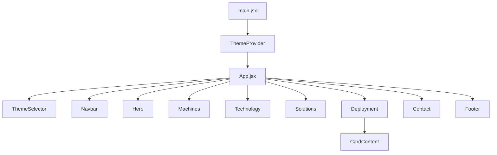

# 9. Project Structure

## 9.1 Folder Tree

```
VendingMachine/
├── index.html                  # HTML entry point
├── package.json                # Dependencies and scripts
├── vite.config.js              # Vite configuration
├── eslint.config.js            # ESLint flat config
├── .gitignore                  # Git ignore rules
├── README.md                   # Project README (auto-generated)
│
├── public/
│   ├── favicon.svg             # Browser tab icon
│   └── icons.svg               # SVG icons collection
│
├── src/
│   ├── main.jsx                # React entry point
│   ├── App.jsx                 # Root component (composes sections)
│   ├── App.css                 # Empty/unused
│   ├── index.css               # Global styles + Tailwind + keyframes
│   │
│   ├── Colors/
│   │   └── Colors.jsx          # Theme color definitions
│   │
│   ├── context/
│   │   └── ThemeContext.jsx     # Theme provider + hooks
│   │
│   ├── hooks/
│   │   └── useBlurReveal.js    # GSAP scroll-triggered blur animation
│   │
│   ├── assets/
│   │   ├── BlueVM.png          # Blue vending machine image
│   │   ├── GreenVM.png         # Green vending machine image
│   │   ├── PurpleVM.png        # Purple vending machine image
│   │   └── YellowVM.png        # Yellow vending machine image
│   │
│   ├── components/
│   │   ├── Navbar.jsx          # Fixed navigation bar
│   │   └── ThemeSelector.jsx   # Floating theme switcher
│   │
│   └── Sections/
│       ├── Hero.jsx            # Hero section with carousel
│       ├── Machines.jsx        # Machine categories grid
│       ├── Technology.jsx      # Feature cards grid
│       ├── Solutions.jsx       # Industry solutions carousel
│       ├── Deployment.jsx      # Deployment timeline
│       ├── Contact.jsx         # Contact info + form
│       └── Footer.jsx          # Site footer
│
├── docs/                       # This documentation
│   ├── README.md
│   ├── 01_Project_Overview.md
│   ├── 02_Sitemap.md
│   ├── 03_Pages.md
│   ├── 04_Components.md
│   ├── 05_Design_System.md
│   ├── 06_Animations.md
│   ├── 07_Responsive.md
│   ├── 08_User_Flows.md
│   ├── 09_Project_Structure.md
│   ├── 10_Assets.md
│   ├── 11_Improvement_Report.md
│   └── screenshots/
│
└── dist/                       # Build output (gitignored)
```

## 9.2 Component Tree



## 9.3 Data Flow

```
ThemeContext (src/context/ThemeContext.jsx)
    │
    ├── Provides: { colors, setTheme, themes }
    │
    ├── useColors() → used by:
    │   ├── Navbar
    │   ├── Hero
    │   ├── Machines
    │   ├── Technology
    │   ├── Solutions
    │   ├── Deployment (including CardContent)
    │   ├── Contact
    │   └── Footer
    │
    └── useTheme() → used by:
        └── ThemeSelector
```

## 9.4 Dependencies

| Package | Type | Purpose |
|---------|------|---------|
| `react` / `react-dom` ^19 | dependency | UI framework |
| `tailwindcss` ^4 | dependency | Utility-first CSS |
| `@tailwindcss/vite` ^4 | dependency | Tailwind Vite plugin |
| `gsap` ^3 | dependency | Scroll-triggered animations |
| `framer-motion` ^12 | dependency | Mobile menu transitions |
| `lucide-react` ^1 | dependency | Icon library |
| `vite` ^8 | devDependency | Build tool |
| `@vitejs/plugin-react` ^6 | devDependency | React Fast Refresh |
| `@rolldown/plugin-babel` | devDependency | Babel for React Compiler |
| `babel-plugin-react-compiler` | devDependency | React 19 Compiler |
| `eslint` ^10 | devDependency | Linting |
| Various ESLint plugins | devDependency | React-specific lint rules |

## 9.5 No Routing

The project has **no routing** (no React Router, no page navigation). It is a single-page scroll-based site using HTML anchor IDs for navigation. All sections render in order within `App.jsx`.

## 9.6 State Management

There is no global state library (Redux, Zustand, etc.). State management is limited to:

| Mechanism | What it manages |
|-----------|----------------|
| React Context (`ThemeContext`) | Current theme colors |
| Component `useState` | UI state per component (menu open, active slide, etc.) |
| `useRef` | DOM refs, timer IDs, drag state |
| `useCallback` | Memoized handlers (Solutions carousel) |

## 9.7 Key Observations

1. **No shared component library** — every UI element is built inline with Tailwind classes
2. **No TypeScript** — all JSX files use plain JavaScript
3. **No testing** — no test runner or test files in `package.json`
4. **No CSS modules or CSS-in-JS** — pure Tailwind + inline styles
5. **`App.css` is empty** — can be deleted safely
6. **`"use client"` directive** at the top of Navbar.jsx is a Next.js convention and has no effect in Vite/React SPA — can be removed
